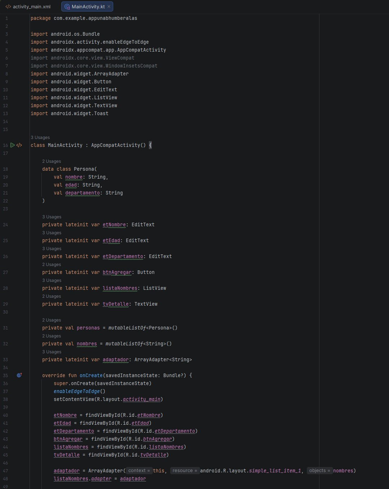
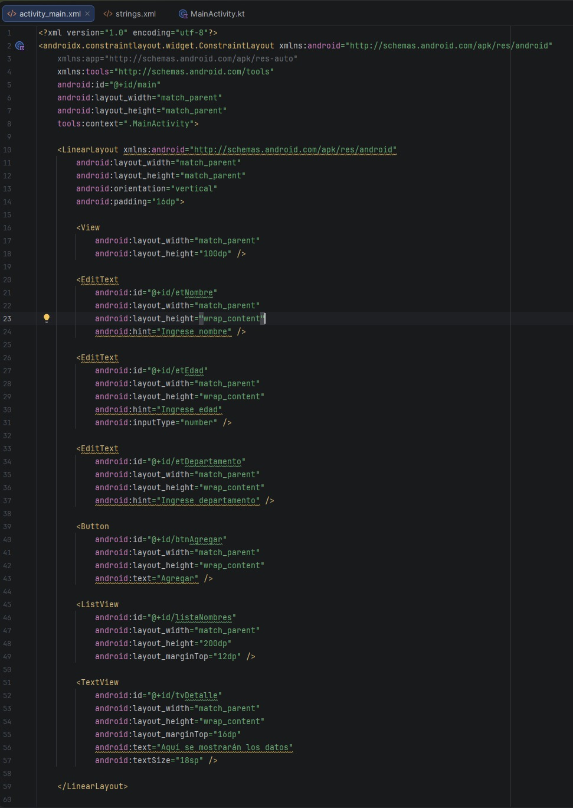
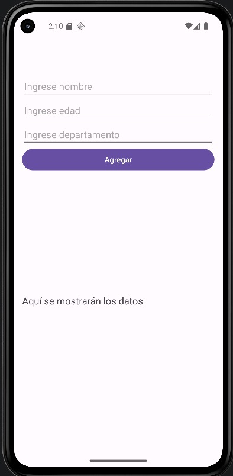
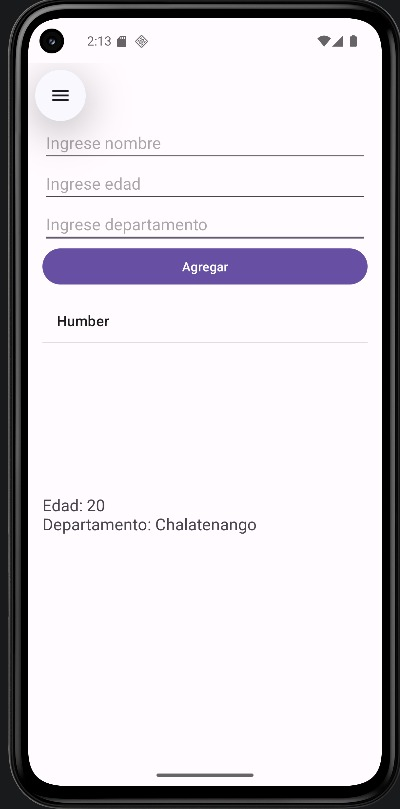

# Segundo Laboratorio - Desarrollo Web y Aplicaciones Para Móviles

## Información general

**Facultad:** Tecnología e innovación  
**Carrera:** Ingeniería en Sistemas y Computación  
**Ciclo:** I 2026  
**Asignatura:** Desarrollo Web y Aplicaciones Para Móviles  
**Tarea:** Segundo Laboratorio  

---

## Docente

**Ingeniero:** Jonathan Francisco Carballo Castro  

---

## Estudiantes

**Nombres:** 
Jonathan Humberto Alas Landaverde y Jeremy Odir Fuentes Soriano

---

## Fecha de entrega

27 de Marzo de 2026  

---

## Documento del laboratorio

Puede ver el documento completo aquí:

👉 [Ver presentación del laboratorio](./Laboratorio2.pdf)

---

## Evidencias de la aplicación con capturas

### Pantalla inicial

### Ingreso de datos

### Nombre agregado a la lista

### Visualización de detalle

